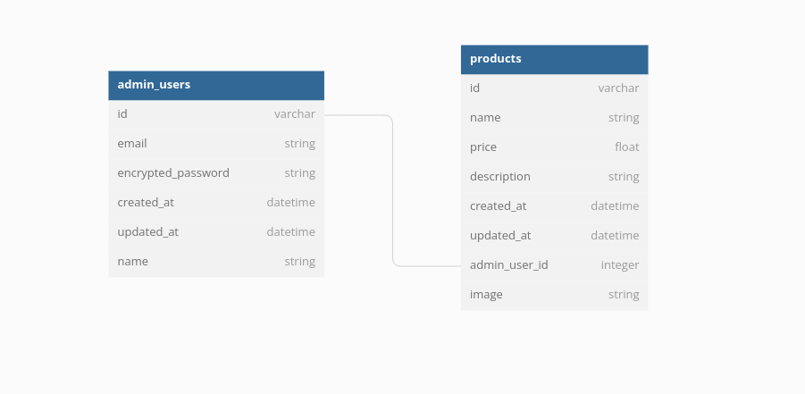

<h2> Educatly Back-end Challenge </h2>

# Contents
 - [About](#about) 
 - [Database Schema](#database-schema) 
 - [Pre Installations](#pre-installations)
 - [Project Cloning](#project-cloning)
 - [Running The Project](#running-the-project)
 - [Main Routes](#main-routes)

## About

- This is a Challenge about a project where admins can create/edit/show/delete products, and can show admins profiles, and can register and admin and login/logout.

## Database Schema

## Pre Installations

- [Docker](https://www.digitalocean.com/community/tutorials/how-to-install-and-use-docker-on-ubuntu-20-04)
- [Docker Compose](https://linuxhostsupport.com/blog/how-to-install-and-configure-docker-compose-on-ubuntu-20-04/)
- [Docker Desktop](https://docs.docker.com/desktop/install/ubuntu/)

## Project Cloning

- [Clone Any Project From Github](https://www.theserverside.com/blog/Coffee-Talk-Java-News-Stories-and-Opinions/How-to-git-clone-on-Ubuntu-with-GitLab-and-GitHub)

## Running the Project

to run the project you need to do the following 

`docker-compose build`

`docker-compose up`

to debug the project using byebug while the docker is app use

`docker attach educatly_app_1`

to access the rails console too, use 

`docker-compose run app rails console`

## Main Routes

the root url to register a new admin:
- [http://localhost:3001/](http://localhost:3001/)

the admins login url:
- [http://localhost:3001/admin/login](http://localhost:3001/admin/login)

once you login you will find two lists (admins, products), you can go and test with main actions for admins, and the same for the products (including uploading images, deleting them, etc).

